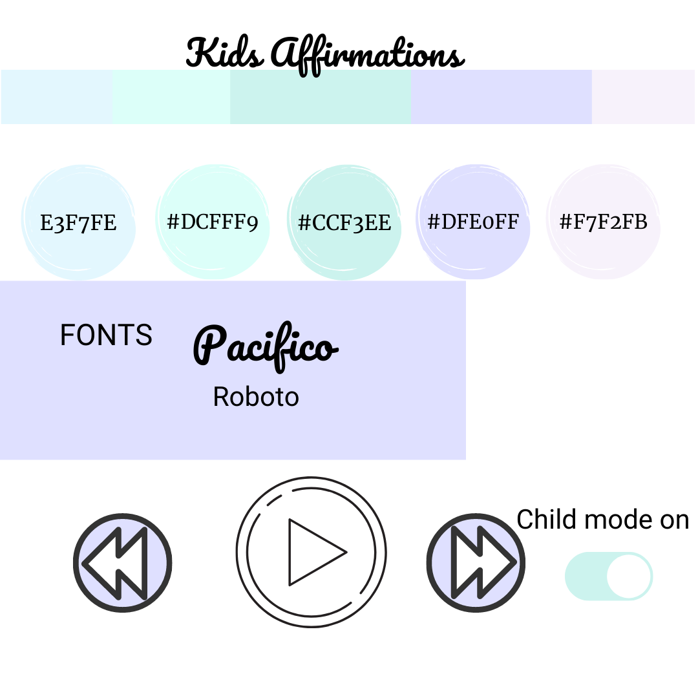

## Welcome to I am...Meditation & Affirmations

This is a family friendly meditation/affirmation site designed for both adults and children. It is a space to come to when you need to take some time out of your day to re-center and re-focus yourself.

In those moments when you or your children are feeling off balance and off kilter with life. Taking two minutes out of the day can really make a difference.

Thank you for visiting my project!  
If you have any feedback or questions, head over to my GitHub contact details and feel free to reach out to me.

You can view the live website [HERE](https://lolaedun.github.io/meditation/)

## **UX**

### **User Goals**

* The website has to work well on all kind of devices like mobile phones, tables and desktops.
* The website has to be fun and interactive.
* Visually appealing website.
* Website should be easily tailored to the individual adult/child.
* Meditation/Affirmation should be shareable.

### **User Stories**

* As a user, I would like to choose timing of meditation/affirmation.
* As a user, I would like to set my meditation/affirmation environment to suit my needs.
* As a user, I would like to be able to switch off sound but keep timer and video going.
* As a user, I would like to be able to have access to meditation regardless of the device i'm using.
* As a user, I would like to be share my meditation or affirmation with a friend.

### **Site owners Goals**
* To build a simple API with family friendly affirmations.
* To create different user modes.
* To collate different background sounds for meditation.
* To collate different background images/videos to sync with meditations.

## Wireframes

These wireframes were created using [Balsamiq](https://balsamiq.com/) during the Scope Plane 
part of the design and planning process for this project. I have created wireframes for phone, tablet and Desktop in a pdf which you can 
view here:

### [View all wireframes here](wireframes/meditation-wireframes.pdf)

### Fonts

- **Pacifico** as the headline text and **Roboto** as body text. I went for very simple and easy to read fonts.

### Icons

media player buttons, toggle switches, button icons.

### Colours Mood board and Mockups

- Pastel, soft colours, relaxing imagery, texture, nature, movement.

# Features
## Existing Features

### Elements on the page

#### Play icon
On the play button I have added event listeners to start the background music and video as well as the default countdown timer or selected time.

The pause icon displays as soon as play is activated. Pressing the pause button will pause both audio and video playback
#### Next and Previous icons
The next button will fire up a new background image/video when pressed as well as queue up a new background audio and new affirmation. It will also load the timer to default or previously selected time.

I have purposely chosen to not autoplay video and sound when the previous or next buttons are pressed to give the user the ability to set their meditation space and requirements before starting.

#### Affirmations

I created an object array for affirmations that are assigned to specific image/video. These affirmations change when the next or previous buttons are clicked.

I chose affirmations that work well for both children and adults to make it a family friendly space.
#### Time Select buttons

There are three time options to choose from which will activate the countdown timer. These timing options are suitable for the beginner meditator, the busy parent or personal lifestyle and for children to get comfortable with the idea of taking short times out of their day to go within on a daily basis.

#### Timer countdown

The default time begins at 10mins. If the user selects a different time from the selector buttons then the countdown will automatically update. At the end of the countdown, the timer will automatically reset to the previously chosen time. 

I have also ensured the seconds are displayed in double digits from number 9, but left the minutes to display in single digit for a cleaner and more simple look.

#### Background Image/Video

I have chosen use background video over images and ensured this plays well across various devices. The video version assists with helping to sit through the meditation/affirmation for longer periods and provides a form of guided imagery.

I have opted for simple imagery/videoes that dont distract from the ability to see the buttons and affirmations as well as to ensure a relaxed state is quickly achieved without too much going on. Footage of nature has helped me to achieve this goal.

#### Volume control
I initally wanted to include this feature but decided against it as it took away from the simple and clean background space I was looking to create. I feel the user automatically adjusts the volume on their device when watching videos or listening to sounds so it wasn't necessary to have it displayed on screen. 

Sound can be muted on users device if they would prefer a quiet meditation or are in a space where having the sound on will bring unwanted attention to the user.

### Features Left to Implement

- child mode
- Social share button
- audio fade on pause or at end of timer

## Technologies Used

- [Git](https://gist.github.com/derhuerst/1b15ff4652a867391f03) to handle version control.
- [GitHub](https://github.com/) to store and share all project code remotely.
- [Imgbb](https://imgbb.com) to store external images for this project that were not entered into the database.
- [Balsamiq](https://balsamiq.com/) to create the wireframes for this project.
- [Canva](https://www.canva.com/) to create graphics and images.

### Libraries

- [Bootstrap](https://www.bootstrapcdn.com/) to simplify the structure of the website and make the website responsive easily.
- [FontAwesome](https://www.bootstrapcdn.com/fontawesome/) to provide icons for the website.
- [Google Fonts](https://fonts.google.com/) to style the website fonts.
- [Canva](https://www.canva.com/) to design mood board and video for the website.

### Languages
- This project uses HTML, CSS and JavaScript programming languages.

## **Testing**

#### User story:
As a user, I would like to choose timing of meditation/affirmation.

* **Plan**  
My plan is to create 3 buttons for the user to choose various time options from.

* **Implementation**  
I created 3 simple buttons that changed on hover. These buttons trigger the timer countdown when clicked.

* **Test**

* **Result**

* **Verdict**  

#### User story:
As a user, I would like to set my meditation/affirmation environment to suit my needs.

* **Plan**  
My plan is to create simple and quick options for the user to create a meditation space that suits them from selecting background image/video to selecting audio and times.

* **Implementation**  

* **Test**

* **Result**

* **Verdict**  

#### User story:
As a user, I would like to be able to have access to meditation regardless of the device i'm using.

* **Plan**  
To create a responsive website that works across various devices.

* **Implementation**  

* **Test**

* **Result**

* **Verdict** 

#### User story:

## Credits

### Content - Media - Inspiration

I have used the following websites to gather ideas, information, background images and sounds for the overall content of my website: 

* [Ben Sound](www.bensound.com)
* [Dev Ed](https://www.youtube.com/watch?v=oMBXdZzYqEk&ab_channel=DevEdDevEd)
* [Traversy Media](https://www.youtube.com/watch?v=QTHRWGn_sJw&ab_channel=TraversyMediaTraversyMediaVerified)
* [fesliyanstudios](https://www.fesliyanstudios.com/royalty-free-music/downloads-c/peaceful-and-relaxing-music/22)
* [Pixabay](https://pixabay.com/music/?utm_source=link-attribution&amp;utm_medium=referral&amp;utm_campaign=music&amp;utm_content=2055)
* [Google Chrome Momentum](https://chrome.google.com/webstore/detail/momentum/laookkfknpbbblfpciffpaejjkokdgca?hl=en)
* [I am, I can](https://www.dk.com/uk/book/9780241420256-i-am-i-can/)

 

I have used [Canva](https://www.canva.com/) to create all my images and graphics.
I also used [ColourLovers](https://www.colourlovers.com/palettes) to find inspiration for my colour palette.

